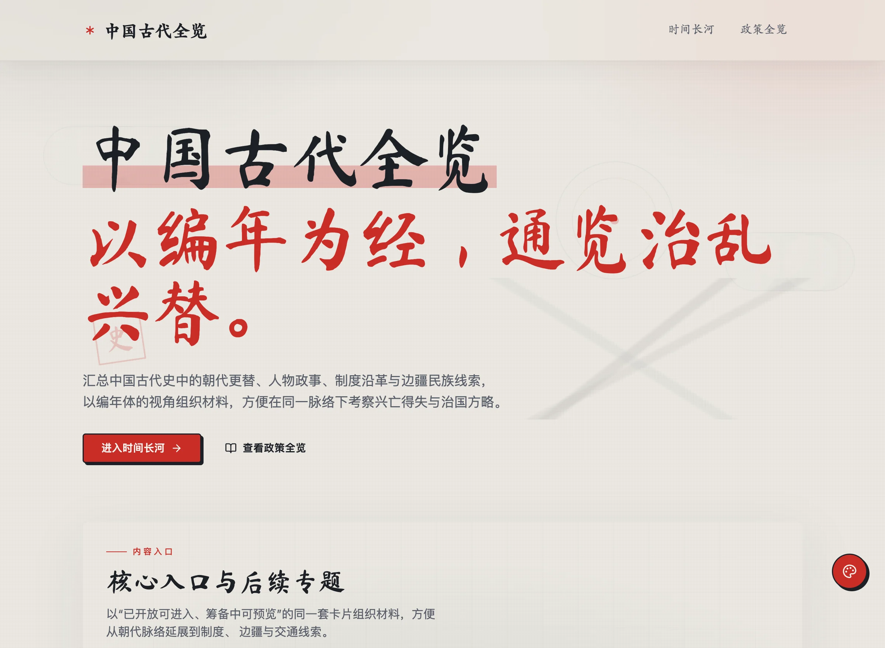
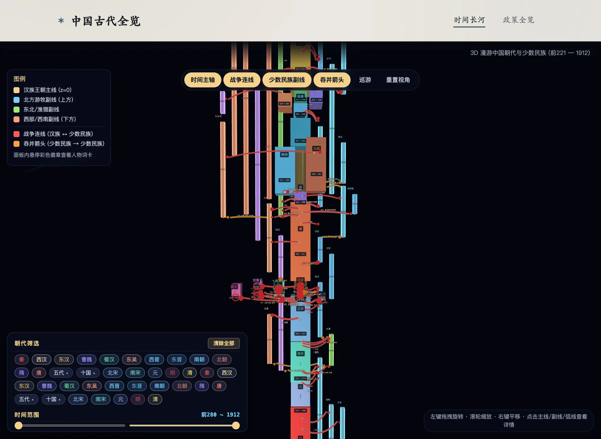
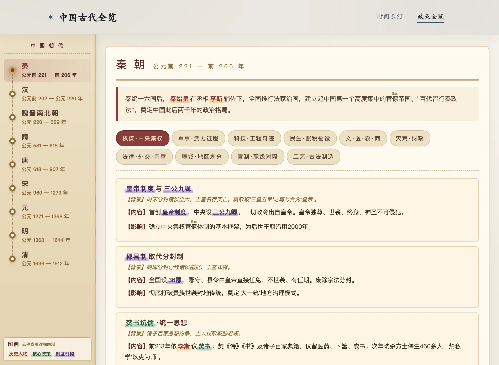

# 中国古代全览

中国古代全览是一个以编年视角组织中国古代史材料的 React 单页应用。项目聚合朝代更替、民族关系、战争线索、治国政策、制度沿革与外部 HTML 资源，提供沉浸式首页、3D 时间长河、朝代政策全览和资源化专题阅读路径。

## 预览地址

线上站点由 Vercel 提供服务：

- 自定义域名：https://china.chaosmic.cn/

> 早期文档中列出的 `https://yanhuang.netlify.app/` 站点已不存在（返回 404），故不再列出。Vercel 自动分配的生产部署 URL 处于密码保护状态，不能作为公开预览地址；对外访问请使用上面的自定义域名。

## 核心内容与截图

| 页面 | 预览地址 | 内容 | 截图 |
| --- | --- | --- | --- |
| 首页 | https://china.chaosmic.cn/ | 水墨风首页、画卷入场动画与全局换色入口。画卷动画每个浏览器窗口只展示一次，状态存储在 `sessionStorage`；主题色偏好存储在 `localStorage`。 |  |
| 时间长河 | https://china.chaosmic.cn/china/timeline | 基于 Three.js 的 3D 朝代与少数民族关系漫游，包含主时间轴、战争连线、民族副线、吞并箭头、朝代筛选与时间范围筛选。`/china` 会重定向到此页面。 |  |
| 政策全览 | https://china.chaosmic.cn/china/policies | 按朝代整理核心政策、制度机构、历史人物、疆域治理与文化科技内容。 |  |
| HTML 专题资源 | https://china.chaosmic.cn/silk-road | 静态 HTML 资源通过 `iframe srcDoc` 隔离渲染，并由 `resources/html-resource/*.json` 提供首页卡片、阅读指南等元数据。缺少元数据的 HTML 会被自动过滤。 | - |

## 技术栈

| 领域 | 选型 |
| --- | --- |
| 框架 | React 19 + TypeScript |
| 构建 | Vite 8（Rolldown 内核） |
| 路由 | React Router 7 |
| 样式 | Tailwind CSS 4、shadcn/ui、Emotion |
| 动画 | GSAP、CSS Animation |
| 3D | Three.js |
| 质量 | Biome、TypeScript、Vitest、Testing Library |
| 分析 | Vercel Analytics |
| 包管理 | pnpm 10 |

## 环境要求

| 项目 | 版本 | 说明 |
| --- | --- | --- |
| Node.js | `>= 20.19.0` | Vite 8 的最低要求。**推荐 Node 22 LTS**，CI 也固定使用 Node 22。 |
| pnpm | `10.18.1` | 由 `package.json` 的 `packageManager` 字段锁定，推荐用 Corepack 启用 |

```bash
corepack enable   # 按 packageManager 字段启用指定 pnpm 版本
```

> Vercel 上 `engines.node: ">=20.19.0"` 会被解析到当前最新 LTS（目前为 Node 24.x）。本地与 CI 使用 Node 22 属于预期差异，两者都满足 `>= 20.19.0`。

## 本地开发

```bash
pnpm install
pnpm dev
```

默认开发地址为 `http://localhost:5173`。如果端口被占用，Vite 会自动切换到下一个可用端口。Vite dev server 自带 history fallback，因此 `/china/policies` 等深链接在开发环境可直接访问。

### 常用脚本

| 命令 | 说明 |
| --- | --- |
| `pnpm dev` | 启动 Vite 开发服务器 |
| `pnpm lint` | 运行 Biome 检查（lint + format） |
| `pnpm lint:fix` | 自动修复 Biome 报告的问题 |
| `pnpm format` | 仅按 Biome 规则格式化 |
| `pnpm typecheck` | 运行 TypeScript 类型检查 |
| `pnpm test` | 运行 Vitest 单元测试 |
| `pnpm test:watch` | 以 watch 模式运行测试 |
| `pnpm test:coverage` | 运行测试并输出覆盖率（文本 / JSON / HTML） |
| `pnpm build` | 类型检查并构建生产产物到 `dist/` |
| `pnpm preview` | 本地预览生产构建，默认 `http://localhost:4173` |

## 质量门禁

提交前需要全部通过：

```bash
pnpm lint
pnpm typecheck
pnpm test
pnpm test:coverage
pnpm build
```

测试覆盖率由 Vitest 强制校验：`statements ≥ 93`、`lines ≥ 94`、`functions ≥ 90`、`branches ≥ 80`。任一项低于阈值，`pnpm test:coverage` 会以非零码退出并让 CI 失败。

分支阈值低于其余三项是有意为之：剩余未覆盖分支几乎全是环境守卫（`typeof window === "undefined"`）和防御性回退——385 张政策卡片全部带有 `bg`/`content`/`impact`，419 条术语全部带有 `title`/`type`/`body`，这些回退在当前数据集下无法触发。把分支覆盖率推到 90% 需要删除全局对象或 mock 数据文件，那会让测试更糟。

GitHub Actions 会在 `main` 分支的 push 与 PR 上自动执行同一组检查，见 `.github/workflows/ci.yml`。

### 测试超时说明

`vite.config.ts` 中把 Vitest 的 `testTimeout` 放宽到 `20000`。政策全览与时间长河页面会渲染数据密集的 DOM 树，jsdom 下单次 `render()` 成本较高，5 秒默认值在负载较高的 CI runner 上余量不足。真实断言失败仍会立即报错，该设置只放宽时间预算，不会掩盖问题。

## 路由与资源机制

| 路径 | 说明 |
| --- | --- |
| `/` | 首页，展示核心入口、筹备中专题与资源聚合内容 |
| `/china` | 兼容旧入口，自动重定向到 `/china/timeline` |
| `/china/timeline` | Three.js 3D 时间长河 |
| `/china/policies` | 朝代政策全览 |
| `/<html-resource-slug>` | 从 `resources/html/*.html` 自动生成，文件名会按 kebab-case 转为路由 |
| `*` | 404 兜底页面 |

`/ancient-china` 是唯一保留的旧版 HTML 页面（141 kB，`showInHome: false`），它同时是生成式路由的测试夹具。

新增 HTML 专题资源时，应同时提供：

- `resources/html/<name>.html`：原始 HTML 内容。
- `resources/html-resource/<name>.json`：符合 `src/pages/page-resources.ts` 中 `PageResourceConfig` 的元数据。
- 可选 `resources/html-data/<name>.json`：供 HTML 中 `id="ndata"` 且带 `data-resource` 的空脚本标签内联使用。

如只新增 HTML 而未提供 `html-resource` 元数据，应用会自动跳过该资源，避免阻塞首页与路由初始化。

### HTML 资源的按需加载

`resources/html/*` 与 `resources/html-data/*` 的体积合计约 9MB，因此它们**不会**进入首屏 bundle：

- 路由表和首页卡片只需要 `path` 和 `resources/html-resource/*.json` 元数据（十几 KB），这些在启动时同步解析。
- HTML 正文与 JSON 数据被拆成独立 chunk，仅在真正打开某个专题页时才动态加载；`HtmlResourcePage` 通过 `React.lazy` + `Suspense` 渲染，加载期间显示「正在铺展卷轴」。
- 同一份 HTML 若被多个资源引用，`import.meta.glob` 仍会各自产出一个 chunk。
- `<script id="ndata" data-resource="...">` 只会拉取该 HTML 实际引用到的 JSON，多余的 `html-data` 文件不会被打包。

新增专题资源不需要为体积做任何额外处理，构建产物会自动按资源拆分。

## 项目结构

```text
src/
├── components/
│   ├── layout/                 # 全局布局与导航
│   ├── ui/                     # shadcn/ui 基础组件
│   ├── home-entrance-animation.tsx
│   └── history-scroll-unfold.tsx
├── hooks/                      # 可复用 Hook
├── lib/                        # 通用工具
├── pages/
│   ├── ancient/china/          # 3D 时间长河
│   ├── ancient/china-policies/ # 政策全览
│   ├── html-resources/         # resources/html 动态路由与 iframe 渲染
│   ├── upcoming/               # 筹备中专题资源
│   ├── home.tsx
│   ├── not-found.tsx
│   └── page-resources.ts
├── route-layout-config.ts      # 路由级布局配置
├── routes.tsx                  # 路由表
├── styles/globals.css          # Tailwind 4 token 与全局样式
├── App.tsx                     # 根组件
└── main.tsx                    # 应用入口

resources/
├── html/                       # 可自动路由的 HTML 专题资源
├── html-data/                  # HTML 资源可选 JSON 数据
└── html-resource/              # HTML 资源的 PageResourceConfig 元数据

public/
├── heritage/                   # 非遗手艺实拍图（由 HTML 资源以 /heritage/*.jpg 引用）
├── chaos.png
└── favicon.ico

scripts/
└── babel-plugin-jsx-source-location.cjs # JSX data-source 注入插件
```

## 开发约定

- 源码使用 TypeScript，文件名使用小写短横线。
- 项目内导入使用相对路径，不使用 `@/` alias。
- 条件类名拼接统一使用 `src/lib/utils.ts` 的 `cn()`。
- 优先使用 Tailwind utility class；复杂动态样式再使用 Emotion 或局部 CSS。
- 用户偏好类状态使用 Web Storage 持久化：跨会话偏好用 `localStorage`，单窗口体验状态用 `sessionStorage`。
- 全局换色状态在 `RootLayout` 初始化，需保证 Header、首页、404 等路由实时响应。
- 装饰性覆盖层需设置 `pointer-events: none`，避免遮挡交互。
- 复杂 HTML 资源使用 `iframe srcDoc` 隔离渲染，不直接混入 React DOM。
- Vite 构建通过 `@rolldown/plugin-babel` 注入 JSX `data-source` 属性，便于从 DOM 定位源文件；配置变更需同步维护 `scripts/babel-plugin-jsx-source-location.cjs` 及其测试。
- 不提交 `dist/`、`coverage/`、`node_modules/`。

## 部署

项目是纯静态 Vite SPA，仓库中的 `vercel.json` 完整声明了构建与路由行为，Vercel 上无需再手动配置 Build Command / Output Directory。

### vercel.json 关键项

| 字段 | 值 | 作用 |
| --- | --- | --- |
| `framework` | `vite` | 使用 Vite 框架预设 |
| `installCommand` | `pnpm install --frozen-lockfile` | 与 CI 一致的可复现安装，lockfile 不同步时构建直接失败 |
| `buildCommand` | `pnpm build` | 执行 `tsc -b && vite build` |
| `outputDirectory` | `dist` | Vite 产物目录 |
| `devCommand` | `pnpm dev` | `vercel dev` 使用的开发命令 |
| `headers` | `/assets/(.*)` → `max-age=31536000, immutable` | 带内容哈希的产物长期强缓存 |
| `rewrites` | `/(.*)` → `/index.html` | SPA 深链接回退 |

关于 rewrite 顺序：Vercel 的 `rewrites` 在文件系统检查**之后**才生效，因此 `/assets/*.js`、`/chaos.png` 等真实文件仍会命中磁盘，只有不存在的路径才会回退到 `index.html`。不要把 `source` 写成具体文件名，否则会被文件系统优先命中。

### 部署方式

**方式一：Git 集成（推荐）**

在 Vercel Dashboard 中 `Add New → Project`，导入仓库后 Vercel 会自动读取 `vercel.json`。确认 Project Settings 中的 Node.js Version 与 `engines.node` 兼容即可，`main` 分支每次 push 都会触发部署。

**方式二：Vercel CLI**

```bash
npx vercel          # 预览部署
npx vercel --prod   # 生产部署
```

**方式三：`vercel dev` 本地验证**

```bash
npx vercel dev
```

`vercel dev` 会读取同一份 `vercel.json`，可在推送前验证 rewrite 与 header 行为。注意 `cleanUrls`、`has` 等部分能力在 `vercel dev` 下与线上存在差异。

### 部署后自检清单

针对公开地址 `https://china.chaosmic.cn/` 执行：

1. 打开 `/`，首页正常渲染。
2. 直接访问 `/china/timeline`、`/china/policies` 等深链接，确认不是 404（验证 rewrite）。
3. 打开任意 `/<html-resource-slug>`，确认 `iframe srcDoc` 内容渲染正常。
4. 访问不存在的路径，确认落到应用内 404 页面而非 Vercel 错误页。
5. 在 Network 面板确认 `/assets/*.js` 命中 `Cache-Control: public, max-age=31536000, immutable`。
6. 确认 `/heritage/*.jpg` 以 `image/jpeg` 返回（该目录使用稳定文件名，不走 immutable 规则）。

> Vercel Git 集成会在每次 push 到 `main` 时创建一个 GitHub Deployment，其 `environment_url` 指向 Vercel 生产部署地址。该地址默认受密码保护，会 302 跳转到 SSO 登录页——**这不是站点故障**，验证请使用自定义域名。

### 其他托管平台

任何支持 SPA fallback 到 `index.html` 的静态托管都可以部署本项目（例如 Netlify）。切换平台时需同步更新 `vercel.json` 与本文档的部署章节。

### 环境变量

当前应用不依赖任何构建期或运行期环境变量。Vercel Analytics 无需额外配置。若后续新增环境变量，需在 Vercel Dashboard 的 `Settings → Environment Variables` 中按环境（Production / Preview / Development）分别添加。

## 构建体积

首屏只加载路由表与首页所需的资源，其余内容按需拉取。下表为各路由的实际 gzip 传输量：

| 路由 | gzip 传输量 | 说明 |
| --- | --- | --- |
| `/` | 136 kB | `index` 98 kB + `home` 38 kB |
| `/silk-road` | 193 kB | HTML 与 JSON 各自独立 chunk |
| `/china/policies` | 341–377 kB | 页面 138 kB + 当前朝代的 1–2 张疆域图 |
| `/china/timeline` | 287 kB | Three.js 场景 |
| `/intangible-culture-heritage` | ~1,381 kB | JS 122 kB + 视口内可见的手艺实拍图 |

三处结构性优化已完成：

- **首屏**：HTML 专题资源此前被 `import.meta.glob({ eager: true })` 全量内联进主 chunk，导致首屏 gzip 约 4 MB；改为「同步索引 + 按需文档」后降至 98 kB。
- **`/china/policies`**：11 张疆域 SVG 此前用 `?raw` 全量内联（3.9 MB），改为每张一个代码分割 chunk（`import()`）后页面本身降到 319 kB，且只加载当前朝代用到的图。每张图带内容哈希，可永久缓存。
- **`/intangible-culture-heritage`**：20 张手艺实拍图此前以 base64 嵌在 JSON 里（数据文件 3.1 MB，chunk gzip 2.4 MB）。现抽取为 `public/heritage/*.jpg`，数据文件降至 19 kB（chunk gzip 18 kB），图片按需以 `image/jpeg` 传输。缩略图使用 `loading="lazy"`。

同时删除了 `resources/html/ancient_china_policies.html`（5.6 MB）：它是 React 政策页的旧版 HTML 实现，`showInHome: false` 且全仓库无任何链接指向它。

### 已知限制

`/intangible-culture-heritage` 剩余的 ~1.26 MB 是视口内 11 张实拍图本身。JPEG 已压缩，服务端无法再优化；真正的解决办法是重新编码——这些原图按 46×46 缩略图和 ~1030×330 hero 使用，却平均 117 kB/张，明显偏大。压缩比例属于内容取舍，需人工决定质量基线后再做。

## LICENSE

本项目使用 [Apache License 2.0](./LICENSE) 开源协议。